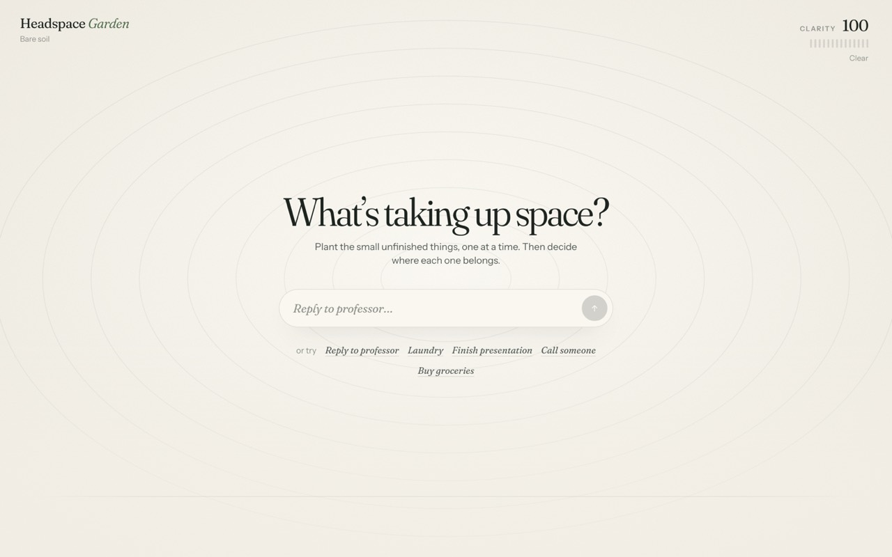
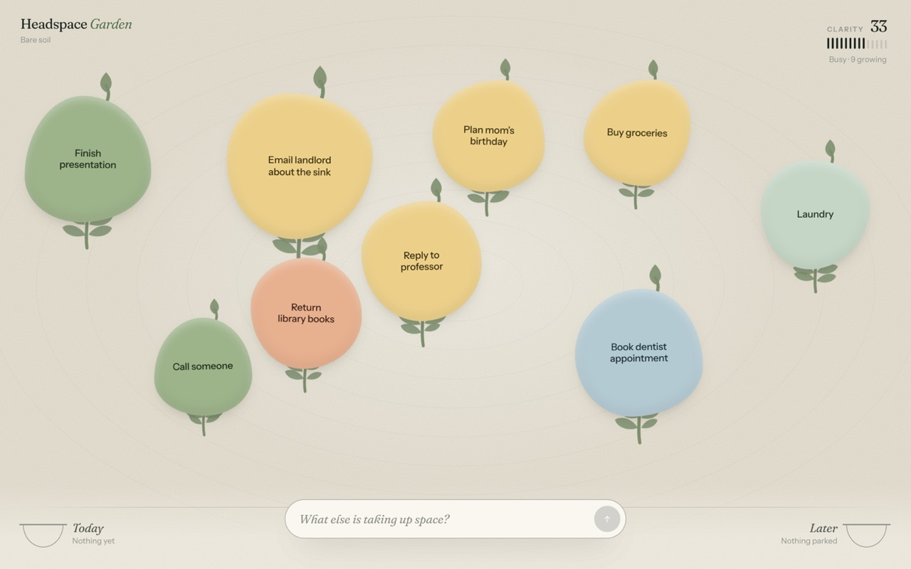
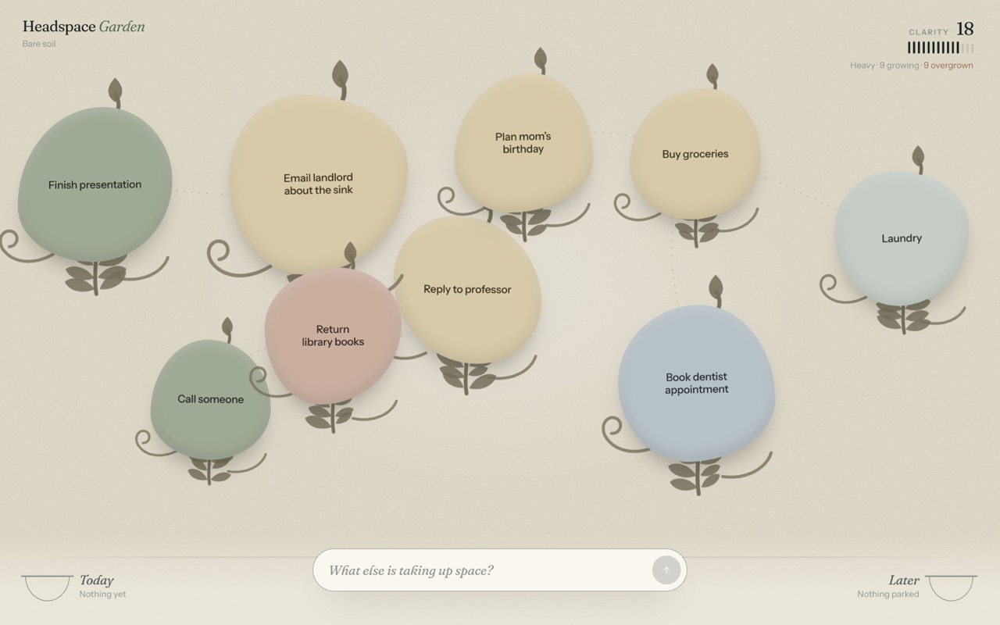
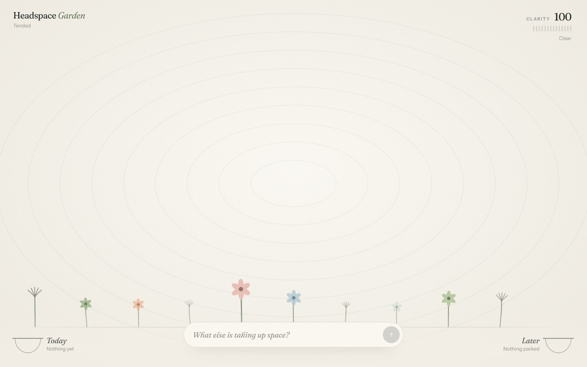
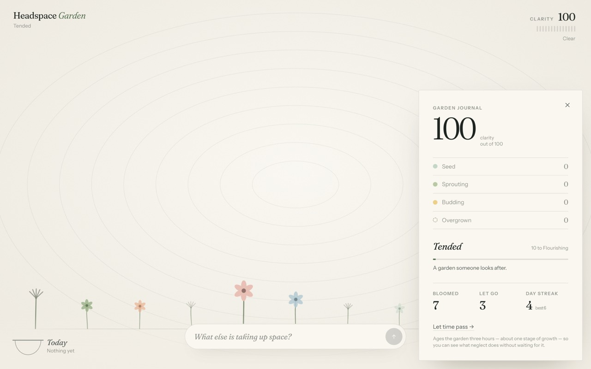
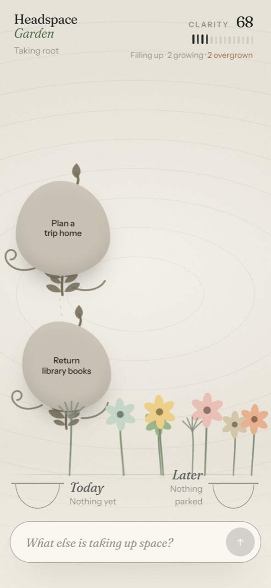

# Headspace Garden

An interactive garden that makes invisible cognitive load visible — and then lets you tend it.

**Course:** MSTU — Individual Interactive Project
**AI tool used:** Cursor (agent mode, Claude Opus)
**Live repo:** https://github.com/hazeljiang0107-del/Individual-Project-MSTU

---

## 1. The idea

Headspace Garden is for anyone carrying a pile of small unfinished obligations — reply
to a professor, laundry, book a dentist appointment — where no single item is a
problem but the accumulation quietly feels heavy. You plant each of those thoughts as
a small living object in a calm garden, watch the space fill up, and then decide what
each one deserves: Today, Later, or letting it go.

> **When someone** adds a small unfinished thought and then decides what to do with it,
> **the experience should** make the weight of that thought physically visible — it takes
> up room, and it grows if ignored — so that tending it feels like reclaiming space
> rather than checking a box.

The one interaction I set out to test: **plant a thought → select it → resolve it into
Today / Later / Release → see the garden change.**



---

## 2. Running it

Requires Node 18 or newer.

```bash
npm install
npm run dev
```

Then open **http://localhost:5174** (the port is pinned in `vite.config.js`; see the
testing notes below for why).

Production build:

```bash
npm run build     # outputs a static site to dist/
npm run preview   # serve that build locally
```

`dist/` is plain static files and can be dropped on Netlify, Vercel, GitHub Pages or
Cloudflare Pages as-is. There is no backend, no account and no API key; state is saved
in the browser's `localStorage`.

**To see growth quickly:** neglect accrues over hours, so the Clarity meter in the top
right opens a journal with a **"Let time pass"** button that ages the garden three hours
per press. Plant six or seven thoughts, press it twice, and the mechanic becomes obvious
in about thirty seconds.

---

## 3. How the experience works

Every small unfinished thing takes up a little mental space. On its own, each one is
nothing; together they crowd the room. As you add thoughts, the garden visibly fills:
the pool of light at its centre shrinks, the raked rings in the ground disappear, and
the Clarity score falls from *Clear* toward *Overwhelmed*.

Then you tend it. Tap a thought to open the inspector and decide where it belongs:

- **Today** — give it a place in today. It's tossed into the Today basket.
- **Later** — park it somewhere safe. It's tossed into the Later basket.
- **Release** — let it go. It swells, blurs and scatters into spores.

### The loop

Two forces pull against each other. This is the part I had to add after testing, and
it's what turned the project from a pretty surface into something with stakes.

**Neglect makes things grow.** A thought doesn't sit still. It moves through four
stages — seed, sprouting, budding, overgrown — driven both by elapsed time and by
crowding: every newer thought still in the garden presses on the older ones. Each stage
adds visible botany (a stem, leaves, a bud, then tendrils) and makes the thought
physically larger, so neglect literally takes up more room. Overgrown neighbours grow
tendrils toward each other, because unresolved things entangle.



Left long enough, a thought goes overgrown: desaturated, heavier, tangled with whatever
is nearest. The two images above and below hold the *same nine thoughts* — only time
has passed. Clarity has dropped from 33 to 18.



**Tending makes something permanent.** Resolving is a promise in two steps. Today and
Later drop a thought into a basket; marking it done makes it **bloom** into a flower
planted for good in the meadow along the bottom of the garden. Releasing plants a pale
**wisp** instead — letting go still counts as progress.

The bloom remembers the stage you caught it at. Tend something early and it comes up
bright and full; let it overgrow first and the flower is smaller and muted. The meadow
becomes an honest record of *how* you tended, not just how much.



### Reading your progress

Progress shows up in four places rather than one:

- **Clarity (0–100)** — weights an overgrown thought about four times as heavily as a
  fresh one, so two neglected items hurt more than five new ones.
- **Garden level** — climbs from *Bare soil* to *Wild garden* as the meadow fills.
- **Daily tending streak.**
- **The meadow itself** — the only thing that never resets.

Tapping the Clarity meter opens the journal: the score, a breakdown by growth stage,
level progress, lifetime totals, the streak, and which thought has waited longest.



Everything works by tap, and the layout adapts to a phone (side panel on desktop
becomes a bottom sheet):



---

## 4. AI tool and selected prompts

Built with **Cursor in agent mode (Claude Opus)**. Below are the exchanges that actually
changed the direction of the project, quoted from my session.

### Prompt 1 — the brief, with constraints and a forced planning step

My opening prompt was long on purpose. I had been warned that vague prompts produce
generic output, so I specified the concept, the user flow, the visual metaphor, the
stack, and a list of things to *avoid*. Excerpts:

> "Headspace Garden helps users make invisible cognitive load visible… Each item becomes
> a floating visual object inside a calm interactive garden. As more items are added, the
> space gradually becomes more crowded and visually busy."
>
> "The experience should feel meaningful, playful, tactile, and launch-ready — not like a
> class assignment, productivity dashboard, or generic to-do app."
>
> "Avoid the typical AI-generated SaaS look. Avoid excessive gradients. Avoid excessive
> rounded cards. Avoid dashboard layouts. Avoid heavy glassmorphism. Avoid making
> everything purple. Avoid cluttered sidebars."
>
> "Before writing the full implementation, first do these three things: 1. Propose the
> information architecture and component structure. 2. Describe the visual system and
> interaction behavior. 3. Identify the minimum set of features needed for a strong first
> prototype."
>
> "If there is a conflict between adding more features and making the main interaction
> feel polished, prioritize the interaction quality."

**Why this mattered:** the "avoid" list and the forced planning step were the two most
useful things I wrote. Making the AI propose architecture *before* coding gave me a
chance to object cheaply, and naming the failure mode I feared ("AI-generated SaaS look")
got me organic blobs and editorial type instead of rounded purple cards. The last line
became the tiebreaker we returned to repeatedly.

### Prompt 2 — debugging something I couldn't see

I opened the browser, got nothing, and sent a screenshot of my terminal with:

> "why is it not showing up"

**What it turned out to be:** port 5173 was already occupied by another process, so Vite
had silently shifted the dev server to 5174 while I kept loading 5173. Nothing was broken;
I was looking at the wrong address. We pinned the port in `vite.config.js` with
`strictPort: true` so it can never silently move again. This was my first real lesson that
"it doesn't work" and "I'm looking in the wrong place" feel identical from the outside.

### Prompt 3 — the critique that reshaped the project

After using the working first version myself:

> "Right now the interaction is too simple. I don't see anything actually growing in the
> garden, and the game mechanism is also a bit too simple and direct. Can you think of
> more gamification in the interaction and let the users visualize their progress more
> than just seeing it visually less crowded, or whatever"

**Why this mattered:** this is the prompt I'd point to as the real work. The first build
did exactly what my original brief asked for — the garden got less crowded as you
resolved things — and it was still unsatisfying. My brief had a flaw in it that I could
only find by using the thing. Everything in "The loop" above exists because of this one
observation.

### Prompt 4 — checking rather than trusting

> "Did you write the reflect paragraph"

**Why this mattered:** it hadn't been written. I had assumed a section existed because a
lot of README had been produced and it *looked* complete. Asking directly instead of
assuming also surfaced a stale sentence in the intro that still described the old
"headspace meter climbs from Clear to Crowded" — a meter that no longer existed after the
Clarity rewrite. Generated documentation goes out of date exactly like generated code.

---

## 5. What I tested, and what changed

I tested in a real browser at desktop (1440×900) and phone (390×844) sizes, driving the
full flow — plant, select, resolve, bloom, release, undo, reload — and watching the
console for errors. Screenshots at both sizes caught things that reading the code did not.

| What I expected | What actually happened | What I changed |
| --- | --- | --- |
| The dev server at `localhost:5173` | Blank page — port 5173 was taken, so Vite had moved to 5174 without my noticing | Pinned `port: 5174, strictPort: true` in `vite.config.js` so it fails loudly instead of moving |
| Resolving thoughts would feel rewarding | It felt flat. The garden emptied, but nothing was ever *built* — the reward was an absence | Added growth stages and the permanent meadow, so tending produces something instead of just removing something |
| Clarity would degrade gradually as thoughts piled up | It hit **0 out of 100** with only ten fresh thoughts, and stayed pinned at 0, which is both punishing and uninformative | Replaced the linear penalty with a smooth exponential curve (`100 · e^(−load/22)`), so the score keeps saying something even in a very full garden |
| Blooms would appear in the meadow | They rendered correctly and were **completely invisible** — they sat underneath the dock's background gradient | Raised the meadow to root 98px above the bottom and shrank the dock's gradient from 60px to 22px |
| Seeds would stay clear of the header | Grown seeds overlapped the wordmark and the meter | Placement only constrained a seed's *centre*. Rewrote `findOpenSpot` to reserve a full grown radius (1.32× planted size) on every edge |
| The flora would read as a plant | First attempt looked like a detached lollipop floating above the blob; second attempt accidentally formed a symmetric "cradle" under every seed | Third attempt: tightened the drawing box from 190% to 150%, made the bud a teardrop hugging the blob, and made the tendrils uneven so they read as vines |
| Growth would be visible while demoing | A thought needs ~6 hours to overgrow, so a demo shows nothing | Added "Let time pass" to the journal, which ages the garden three hours per press |
| Crowding pressure would feel fair | Ten thoughts instantly pushed the oldest to *budding*, which made time feel irrelevant | Gave crowding a free allowance: the first four thoughts sit quietly, and only thoughts beyond that press on their elders |

Two of these deserve a note, because they're the ones where the bug was invisible in the
code. The meadow problem was the strangest: my test script reported `meadow marks: 5`, so
the data and the DOM were both correct, and only a screenshot revealed that all five were
hidden behind a gradient. And the Clarity collapse only became obvious once I put a real
number on screen — "the garden feels full" is not falsifiable, but "0 out of 100 with ten
ordinary thoughts" clearly is.

I also verified: no console errors at either viewport, `localStorage` survives a reload,
undo correctly reverses both releasing and blooming (including removing the meadow mark
it created), and `prefers-reduced-motion` disables drift, morphing, parallax and swaying.

---

## 6. Current features

- **Plant a thought** from the composer ("What's taking up space?"). On first visit the composer sits centred with suggestions; afterwards it docks at the bottom so you can keep planting quickly.
- **Organic thought seeds.** Each thought is a morphing blob with its own shape, colour, drift path, speed and depth. Colour and shape are random and carry no meaning yet; size loosely follows text length for legibility.
- **Four growth stages.** Time and crowding push a thought from seed to overgrown, adding a stem, leaves, a bud and then tendrils, and growing its footprint. A ring pulses each time one reaches a new stage.
- **Entanglement.** Overgrown thoughts are linked to their nearest overgrown neighbour by a faint tendril.
- **Even placement.** New seeds go in the most open spot, kept a full grown radius clear of the header and dock.
- **A garden that responds to load.** Background, light pool, raked rings and grain all track the Clarity score rather than a raw count.
- **Clarity, levels and streaks.** A 0–100 score that weights overgrown thoughts far more heavily, a lifetime level from Bare soil to Wild garden, and a daily tending streak.
- **The meadow.** Every resolved thought leaves a permanent mark along the bottom: a bloom for one you tended, a wisp for one you let go, brightness set by the stage you caught it at.
- **Garden journal.** Tap the Clarity meter for the score, a breakdown by growth stage, level progress, lifetime totals, your streak and which thought has waited longest.
- **"A clearing."** Resolving three things within about forty seconds sweeps light across the garden.
- **Inspect and resolve.** Tap a seed to focus it (the rest dims) and open the inspector, which names its growth stage. Choose Today, Later or Release — keyboard `1` / `2` / `3`, `Esc` to close.
- **Distinct exit animations.** Today and Later toss the seed in an arc into its basket, which catches it with a squash. Release swells, blurs and scatters spores.
- **Baskets.** Today and Later collect a coloured pebble per thought. Tap one to see its list, then *Bloom* an item or *replant* it into the garden.
- **Undo** for both releasing and blooming, via a short-lived toast.
- **Let time pass.** A button in the journal ages the garden three hours — about one stage — so you can see what neglect does without waiting for it.
- **Persistence.** State is saved to `localStorage`, so the garden and the meadow survive a reload.
- **Responsive.** Side panel on desktop, bottom sheet on mobile; all interactions work by tap.
- **Reduced motion.** Drift, morphing, parallax and swaying are disabled when the OS requests reduced motion.

---

## 7. Structure

```
src/
  App.jsx                 state, planting, resolve/bloom/undo flow, streaks
  lib/
    seeds.js              thought factory, palette, placement
    growth.js             growth stages, clarity, levels, blooms, streaks
  hooks/usePersistentState.js
  components/
    Header.jsx            wordmark, level, clarity meter (opens the journal)
    Garden.jsx            the field: light pool, rings, grain, meadow, seeds
    ThoughtSeed.jsx       a single drifting, morphing seed
    Flora.jsx             the stem/leaves/bud/tendrils a seed grows
    Tendrils.jsx          links between entangled overgrown thoughts
    Meadow.jsx            permanent blooms and wisps along the ground
    Composer.jsx          "What's taking up space?" input
    Basket.jsx            Today / Later vessels in the dock
    Inspector.jsx         focus panel with Today / Later / Release
    BasketSheet.jsx       list view for a basket (bloom / replant)
    Journal.jsx           clarity, stage breakdown, level, totals, streak
    Clearing.jsx          the "a clearing" moment
    Toast.jsx             undo for releasing and blooming
  styles/global.css       design tokens, shared panel styles
docs/                     screenshots used in this README
```

Plain CSS, one stylesheet per component. No UI or animation libraries.

---

## 8. Known limitations

These are the problems I know about and could not fully resolve.

- **Growth never pauses.** Neglect accrues in real time whether or not the app is open, and there's no way to snooze a thought or mark it as legitimately long-term. A garden left for a week loads deeply overgrown, which is honest but harsh — a genuinely long-term goal is punished identically to something you're avoiding. Fixing this properly needs a distinction the app can't currently express.
- **Time is compressed.** A thought overgrows in about six hours. That suits one day of obligations and makes the mechanic legible, but it isn't how a real backlog behaves. "Let time pass" is a demo aid: it shifts stored timestamps rather than simulating a clock.
- **Overlap when very full.** Placement is best-effort — I sample 60 candidate positions and keep the most open one. With roughly a dozen grown thoughts on a phone they still overlap, because the screen genuinely runs out of room. Partly intentional (crowding *should* feel crowded), but there's no physics or collision resolution.
- **Positions don't reflow on resize.** Seeds store fractional coordinates, so they survive a resize but can bunch up after a dramatic one.
- **The meadow only accumulates.** It renders the most recent 64 marks, never thins, and has no seasons or browsable history. Past a few hundred resolutions it will read as a solid band.
- **The streak is generous.** Any single tending action counts for the whole day, so it rewards opening the app more than actually clearing anything.
- **No editing.** A thought's text is fixed once planted; release it and plant it again.
- **Colour still means nothing.** Colour and shape are random. Only size and flora encode anything, so the palette is decoration.
- **Fonts load from Google Fonts** (Fraunces, Instrument Sans), with a system serif/sans fallback offline.
- **No AI features inside the app,** by design — the brief ruled out external APIs for this version.

---

## 9. Reflection

The look and the core gesture landed close to what I intended. The garden reads as a
calm, editorial space rather than a productivity dashboard, and sorting a thought into
Today, Later or Release feels like handling an object instead of ticking a box — which
was the whole point of specifying "avoid the typical AI-generated SaaS look" in my first
prompt. What didn't match was the feedback loop, and I couldn't see that until I used the
thing myself. My original brief said the garden should "visibly become calmer and more
spacious" as thoughts were resolved, and the first build did exactly that. It was still
inert. Emptying a screen turns out to be a weak reward: it shows you only what you
removed, never what you built, and nothing in the garden ever actually grew despite the
metaphor promising that it would. The flaw was in my own brief, not in the
implementation, which is the part I found most surprising — the AI had satisfied my
description precisely enough to expose that my description was incomplete. Fixing it
meant giving the metaphor two opposing forces instead of one: neglect now grows a thought
through four stages, driven by elapsed time *and* by how many newer thoughts are still
crowding it, while tending converts it into a permanent flower in the meadow. That second
force is what makes the garden a record instead of a surface.

Most of what I changed came from looking rather than reasoning. Screenshots at desktop and
phone sizes caught failures that reading the code never would have: the Clarity score
collapsed to 0 out of 100 with only ten ordinary thoughts, so I moved it onto an
exponential curve; the meadow was rendering correctly, and was completely invisible
underneath the dock's background gradient; grown seeds were colliding with the header
because placement constrained a seed's centre but not its edges. The flora took three
attempts before it read as botany — a detached lollipop, then an accidental symmetric
"cradle" under every blob, finally uneven curls. AI was fast at implementation and good
at catching its own rendering mistakes once I insisted on visual verification at both
screen sizes, but it could not tell me whether the experience was any good, and the
judgements that shaped the design were mine. The one I care about most is the direction of
the incentive: it would have been easy — and it initially seemed generous — to make a
long-neglected task yield a *bigger* bloom as a reward for finally facing it. That would
have quietly rewarded procrastination and contradicted the entire premise, so a bloom now
records the stage it was caught at and comes up muted if you let it overgrow. Deciding
which behaviour the system should reward was not a coding problem, and no amount of
prompting would have surfaced it. What remains unresolved is mostly emotional rather than
technical. Overgrowth is meant to create just enough tension to prompt action, and I have
not tested whether it instead produces guilt, which would make this app one more thing
taking up space — the exact opposite of its purpose. I also can't tell yet whether the
compressed six-hour timescale is honest to how a real backlog feels, or whether the
distinction the app currently can't express (a thing I'm avoiding versus a thing that
legitimately takes months) makes the growth mechanic unfair in ordinary use.
